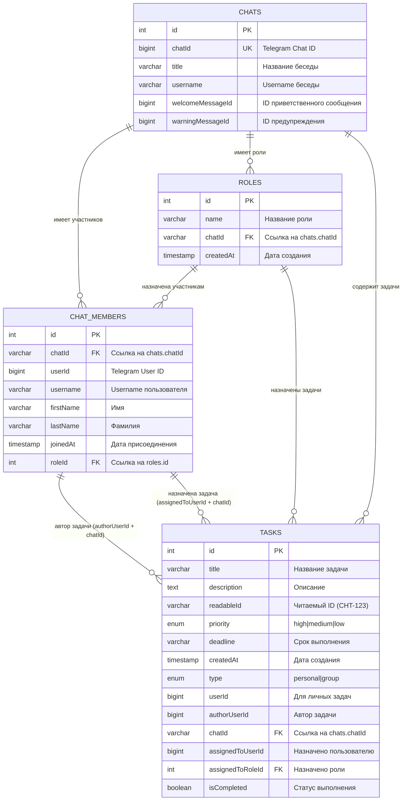

# Схема базы данных Track-It

## Диаграмма связей (ERD)



## Ключевые особенности схемы

### 1. **Иерархия чатов**
- `CHATS` - центральная таблица, содержащая информацию о Telegram беседах
- Каждый чат имеет уникальный `chatId` (из Telegram API)

### 2. **Участники чатов**
- `CHAT_MEMBERS` - участники беседы с их ролями
- Связь с чатом через `chatId`
- Опциональная связь с ролью через `roleId`

### 3. **Система ролей**
- `ROLES` - роли внутри каждого чата
- Каждая роль принадлежит конкретному чату
- Участники могут иметь роли (один участник = одна роль)

### 4. **Задачи с гибким назначением**
- `TASKS` - задачи с поддержкой личных и групповых типов
- **Автор задачи**: связь через составной ключ (`authorUserId` + `chatId`)
- **Назначение**: может быть назначена либо пользователю, либо роли
  - Пользователю: через составной ключ (`assignedToUserId` + `chatId`)
  - Роли: через простой FK (`assignedToRoleId`)

## Примеры запросов

### Получить все задачи чата с авторами и назначениями:
```sql
SELECT 
    t.*,
    author.firstName as author_name,
    assignee.firstName as assignee_name,
    r.name as assigned_role
FROM tasks t
LEFT JOIN chat_members author ON (t.authorUserId = author.userId AND t.chatId = author.chatId)
LEFT JOIN chat_members assignee ON (t.assignedToUserId = assignee.userId AND t.chatId = assignee.chatId)
LEFT JOIN roles r ON t.assignedToRoleId = r.id
WHERE t.chatId = 'some_chat_id';
```

### Получить все задачи, назначенные участнику (напрямую или через роль):
```sql
SELECT DISTINCT t.*
FROM tasks t
LEFT JOIN chat_members cm ON (t.assignedToUserId = cm.userId AND t.chatId = cm.chatId)
LEFT JOIN chat_members cm_role ON (t.chatId = cm_role.chatId AND t.assignedToRoleId = cm_role.roleId)
WHERE (cm.userId = 'target_user_id' OR cm_role.userId = 'target_user_id')
  AND t.chatId = 'some_chat_id';
```